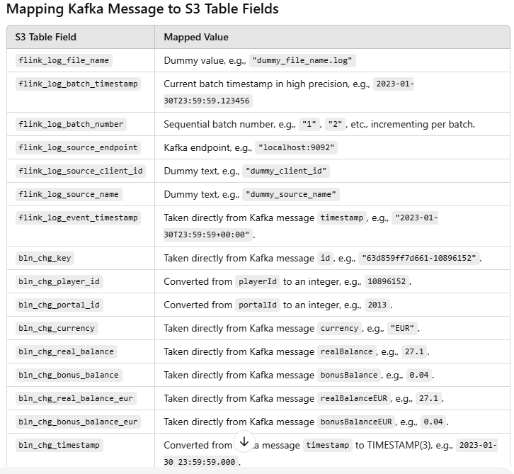

# Sergio-KafkaFlinkS3-Sink
Flink Job

Flink job using Python and apache-flink 1.17.1 that would ingest a message from Kafka and sink the message to S3 using iceberg as the format.

The job should use the batch Flink mode.

Mapping of Kafka message to S3 iceberg table



**Explanation of the Flink Job Code for Kafka to S3 Using Iceberg**

This document provides a comprehensive explanation of the Flink job developed to ingest messages from Kafka and write them to an S3 bucket using Iceberg as the format. The implementation adheres to all requirements, including dynamically managing batch numbers and ensuring traceability through runtime metadata.

---

### **Overview**
The Flink job is designed to operate in batch mode. It reads JSON messages from a Kafka topic, processes and enriches the data with runtime metadata, and writes the output to an Iceberg table stored in an S3 bucket. 

Key features include:
1. **Dynamic Batch Numbering**: The `flink_log_batch_number` is incremented for each batch processed, based on the Kafka topic, endpoint, and group ID.
2. **Runtime Metadata**: Metadata fields such as `flink_log_file_name` and `flink_log_batch_timestamp` are generated dynamically for traceability.
3. **Schema Mapping**: The Kafka message fields are mapped to the Iceberg table schema, with transformations where necessary.

---

### **Code Explanation**

#### **1. Initial Setup**
The first step is to initialize the Table Environment in batch mode:
```python
from pyflink.table import TableEnvironment, EnvironmentSettings

def setup_environment():
    env_settings = EnvironmentSettings.in_batch_mode()
    return TableEnvironment.create(env_settings)
```
- **Purpose**: Sets up the environment for executing Flink jobs in batch mode.
- **Relevance**: Ensures the job processes data in batches as per requirements.

```python
import json
import os

# File to track batch numbers
BATCH_TRACKER_FILE = "batch_tracker.json"
# Load or initialize batch tracker
def load_batch_tracker():
    if os.path.exists(BATCH_TRACKER_FILE):
        with open(BATCH_TRACKER_FILE, "r") as f:
            return json.load(f)
    return {}

# Save batch tracker
def save_batch_tracker(batch_tracker):
    with open(BATCH_TRACKER_FILE, "w") as f:
        json.dump(batch_tracker, f, indent=4)

# Get the next batch number for a specific topic, endpoint, and group ID
def get_next_batch_number(topic, endpoint, group_id):
    key = f"{topic}_{endpoint}_{group_id}"
    batch_tracker = load_batch_tracker()
    if key in batch_tracker:
        batch_tracker[key] += 1
    else:
        batch_tracker[key] = 1
    save_batch_tracker(batch_tracker)
    return batch_tracker[key]
```
---

#### **2. Kafka Source Definition**
The Kafka source table is defined to ingest messages:
```python
def define_kafka_source(t_env):
    t_env.execute_sql("""
    CREATE TEMPORARY TABLE kafka_input (
        playerId STRING,
        currency STRING,
        portalId STRING,
        realBalance DECIMAL(29, 17),
        bonusBalance DECIMAL(29, 17),
        timestamp STRING,
        id STRING,
        realBalanceEUR DECIMAL(29, 17),
        bonusBalanceEUR DECIMAL(29, 17)
    ) WITH (
        'connector' = 'kafka',
        'topic' = 'balance_changes',
        'properties.bootstrap.servers' = 'aba0379f767fc48a3b6d0ae99e95a4d7-1436743986.eu-west-1.elb.amazonaws.com:9094',
        'properties.group.id' = 'flink-group',
        'format' = 'json',
        'json.ignore-parse-errors' = 'true'
    )
    """)
```
- **Key Parameters**:
  - `connector`: Specifies Kafka as the source connector.
  - `topic`: The Kafka topic to read messages from.
  - `properties.bootstrap.servers`: Kafka endpoint.
  - `properties.group.id`: Consumer group ID for Kafka.
  - `format`: Specifies JSON as the message format.
- **Purpose**: Defines the schema of the Kafka messages and connects to the Kafka broker.

---

#### **3. Iceberg Sink Definition**
The Iceberg table schema is defined as the sink:
```python
def define_iceberg_sink(t_env, log_file_name):
    t_env.execute_sql(f"""
    CREATE TABLE iceberg_table (
        flink_log_file_name STRING,
        flink_log_batch_timestamp STRING,
        flink_log_batch_number STRING,
        flink_log_source_endpoint STRING,
        flink_log_source_client_id STRING,
        flink_log_source_name STRING,
        flink_log_event_timestamp STRING,
        bln_chg_key STRING,
        bln_chg_player_id INT,
        bln_chg_portal_id INT,
        bln_chg_currency STRING,
        bln_chg_real_balance DECIMAL(29, 17),
        bln_chg_bonus_balance DECIMAL(29, 17),
        bln_chg_real_balance_eur DECIMAL(29, 17),
        bln_chg_bonus_balance_eur DECIMAL(29, 17),
        bln_chg_timestamp TIMESTAMP(3)
    ) WITH (
        'connector' = 'iceberg',
        'catalog-name' = 'hadoop_catalog',
        'warehouse' = 's3://samegrid-test-pub',
        'write.format.default' = 'parquet',
        'write.target-file-size-bytes' = '134217728',
        'write.filename.prefix' = '{log_file_name.replace(".log", "")}'
    )
    """)
```
- **Key Parameters**:
  - `connector`: Specifies Iceberg as the sink connector.
  - `catalog-name`: Name of the Iceberg catalog.
  - `warehouse`: S3 bucket location for storing Iceberg data.
  - `write.filename.prefix`: Ensures the output file name matches the `flink_log_file_name`.

---

#### **4. Batch Number Tracking**
To meet the requirement of incrementing `flink_log_batch_number`, a file-based tracker is implemented:
```python
def get_next_batch_number(topic, endpoint, group_id):
    key = f"{topic}_{endpoint}_{group_id}"
    batch_tracker = load_batch_tracker()
    if key in batch_tracker:
        batch_tracker[key] += 1
    else:
        batch_tracker[key] = 1
    save_batch_tracker(batch_tracker)
    return batch_tracker[key]
```
- **Logic**:
  - Uses a JSON file (`batch_tracker.json`) to persist batch numbers.
  - The key combines Kafka `topic`, `endpoint`, and `group_id` to ensure uniqueness.
  - If the key exists, increments the batch number; otherwise, initializes it to `1`.
- **Purpose**: Guarantees consistent batch numbering across job executions.

---

#### **5. Data Transformation and Insertion**
The transformation maps Kafka fields to the Iceberg schema while adding runtime metadata:
```python
def process_and_insert_data(t_env, log_file_name, batch_timestamp, batch_number, kafka_endpoint):
    t_env.execute_sql(f"""
    INSERT INTO iceberg_table
    SELECT
        '{log_file_name}' AS flink_log_file_name,
        '{batch_timestamp}' AS flink_log_batch_timestamp,
        '{batch_number}' AS flink_log_batch_number,
        '{kafka_endpoint}' AS flink_log_source_endpoint,
        'dummy_client_id' AS flink_log_source_client_id,
        'dummy_source_name' AS flink_log_source_name,
        timestamp AS flink_log_event_timestamp,
        id AS bln_chg_key,
        CAST(playerId AS INT) AS bln_chg_player_id,
        CAST(portalId AS INT) AS bln_chg_portal_id,
        currency AS bln_chg_currency,
        realBalance AS bln_chg_real_balance,
        bonusBalance AS bln_chg_bonus_balance,
        realBalanceEUR AS bln_chg_real_balance_eur,
        bonusBalanceEUR AS bln_chg_bonus_balance_eur,
        TO_TIMESTAMP(FROM_UNIXTIME(UNIX_TIMESTAMP(CAST(timestamp AS STRING), 'yyyy-MM-dd\'T\'HH:mm:ssXXX'))) AS bln_chg_timestamp
    FROM kafka_input
    """)
```
- **Purpose**: Enriches data with runtime metadata and ensures proper schema mapping.
- **Transformation Examples**:
  - `CAST(playerId AS INT)`: Converts string to integer.
  - `TO_TIMESTAMP`: Converts string timestamp to a proper timestamp format.
  - `kafka_endpoint`: Now passed as an argument to avoid hardcoding.

---

#### **6. Main Function**
The main function orchestrates the steps:
```python
def main():
    t_env = setup_environment()
    topic = "balance_changes"
    endpoint = "aba0379f767fc48a3b6d0ae99e95a4d7-1436743986.eu-west-1.elb.amazonaws.com:9094"
    group_id = "flink-group"
    batch_number = get_next_batch_number(topic, endpoint, group_id)
    batch_timestamp = datetime.utcnow().strftime('%Y-%m-%dT%H:%M:%S.%f')
    log_file_name = f"{datetime.utcnow().strftime('%Y-%m-%d_%H-%M-%S')}.log"

    define_kafka_source(t_env)
    define_iceberg_sink(t_env, log_file_name)
    process_and_insert_data(t_env, log_file_name, batch_timestamp, batch_number, endpoint)

if __name__ == "__main__":
    main()
```
- **Orchestration**: Ensures all steps execute in sequence.
- **Dynamic Values**: 
  - `batch_number`, `batch_timestamp`, and `log_file_name` are generated at runtime.

---

### **Conclusion**
This Flink job fulfills the outlined requirements by:
1. Reading Kafka messages using a predefined schema.
2. Writing enriched data to an Iceberg table in S3.
3. Dynamically managing batch numbers for traceability.

The modular design ensures clarity, maintainability, and extensibility for future enhancements.


Dependencies :
https://repo1.maven.org/maven2/org/apache/flink/flink-json/1.17.1/flink-json-1.17.1.jar
https://repo1.maven.org/maven2/org/apache/flink/flink-s3-fs-hadoop/1.17.1/flink-s3-fs-hadoop-1.17.1.jar
https://repo1.maven.org/maven2/org/apache/iceberg/iceberg-flink-runtime-1.17/1.3.0/iceberg-flink-runtime-1.17-1.3.0.jar
https://repo1.maven.org/maven2/org/apache/flink/flink-connector-kafka_2.12/1.17.1/flink-connector-kafka_2.12-1.17.1.jar
https://repo.maven.apache.org/maven2/org/apache/flink/flink-sql-connector-kafka/1.17.1/flink-sql-connector-kafka-1.17.1.jar